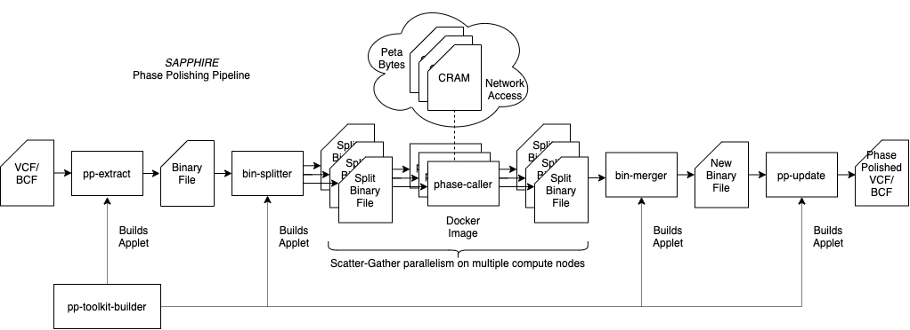

# SAPPHIRE and the PP-Toolkit

**Smart and Accurate Polishing of Phased Haplotypes Integrating Read Enhancements (SAPPHIRE)**

**Phase Polishing Toolkit**

- Improve phased haplotypes with whole genome sequencing reads.
- Benchmark phased haplotypes with whole genome sequencing reads.

Written to scale with massive population scale data and run on the UK Biobank research access platform (RAP).

## Pipeline Diagram



## Directory Structure

- `bin_tools` : Tools to query, split, merge a sparse binary format file for extract heterozygous variants.
- `diagrams` : drawio diagrams.
- `dnanexus_app` : Apps to deploy on the UK Biobank DNANexus RAP, allows to run the tools on the RAP via their interface.
- `dnanexus_scripts` : Scripts to launch jobs on the UK Biobank DNANexus RAP from a computer through the `dx-toolkit`.
- `Docker` : Dockerfile and scripts to create a docker image for the actual phase polishing on the RAP.
- `include` : Shared headers
- `phase-caller` : Source of the phase-caller that does the actual phase polishing given sparse binary file and CRAM file path
- `pp_extractor` : Source of tool to extract heterozygous variants from VCF/BCF and generate sparse binary format file.
- `pp_update` : Source of tool that updates VCF/BCF file with phase polished heterozygous variants from sparse binary file.
- `test` : Unit and Integration Testing folder.

## DNANexus RAP Build instructions

For the DNANexus Research Analysis Platform (RAP) an applet `pp-toolkit-builder` to build the other applets is provided. This applet can be built locally (requires [dx-toolkit](https://github.com/dnanexus/dx-toolkit)) or directly from a "ttyd" instance on the RAP. Once this `pp-toolkit-builder` applet is built, the others can be built from the RAP interface directly.

### Steps to build to PP-toolkit builder and run it to build the applets

1) Start analysis and select `ttyd`. Any instance type is acceptable, we recommend `mem2_ssd2_v2_x2`.
2) Access the `ttyd` terminal with the "Open Worker URL" button from the job monitor.
3) Run the following commands.

```shell
git clone https://github.com/rwk-unil/pp.git
cd pp
dx build dnanexus_app/pp-toolkit-builder
```

4) Check that the `pp-toolkit-builder` applet appeared in your output folder on the RAP.
5) You can now terminate the `ttyd` job.
6) Launch the `pp-toolkit-builder` applet by double clicking on it.
7) Select an output folder for the applets and launch the job.
8) Once finished (build time should be less than 10min) the applets will be available in the chosen output folder.

## Local Build instructions

```shell
# Note all this is done in the Dockerfile, this is only for manual testing

git submodule update --init --recursive
cd xSqueezeit

# Clone and build htslib (if you already have htslib set Makefile accordingly and skip)
cd htslib
autoheader
autoconf
automake --add-missing 2>/dev/null
./configure
make
cd ..

# Clone and build zstd (if you already have zstd set Makefile accordingly and skip)
git clone https://github.com/facebook/zstd.git
cd zstd
make
make install
ldconfig
cd ..
cd ..
make
```
